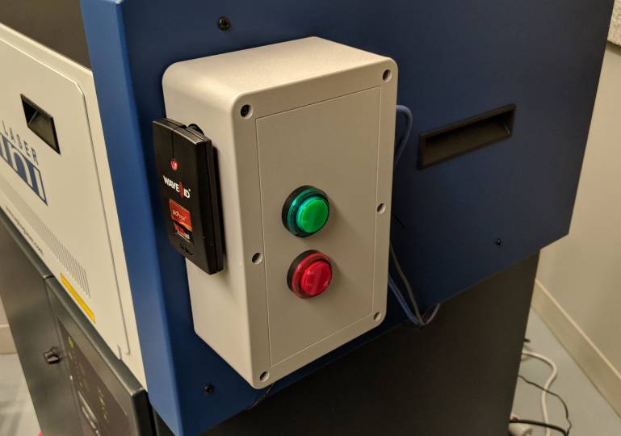

## Makerspace Auth

Like most makerspaces, we need to ensure that people have taken training before
using dangerous tools.  This is the Authbox, a project that we're sharing with
the community and welcoming contributions that help it work with more tools.

We started this project with two goals in mind, for Google makerspaces where
employees all have the same kind of RFID badge:

1. Only people authorized (trained) should be able to use dangerous tools
2. We'd like to have reliable access logs for even non-dangerous tools

## Organization

<pre>
<a href="docs/">docs/</a> Documentation on the project to include contributions on tool connectivity.
<a href="software/">software/</a> The Python client that runs on a Pi.
<a href="hardware/">hardware/</a> The custom Pi hat we use to interact with buttons and a power switch tail.
</pre>

## Contributing

We *welcome* contributions, especially ones that make this more useful to other
makerspaces.  We'd like this to be a generic solution wherever possible.

## Disclaimer

This is **not** an official Google product.
